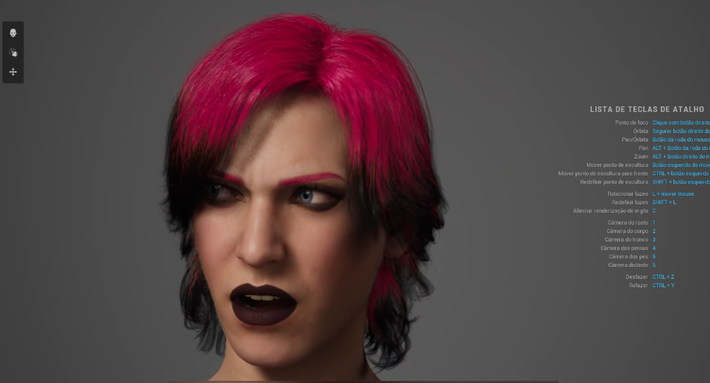

# Humano Virtual: Assistente Vi - Treinadora de League of Legends

## **Parte 1: Contextualização, Descrição e Justificativa**

### **Propósito**
O humano virtual foi projetado como uma assistente virtual interativa para ensinar jogadores iniciantes a jogar **League of Legends** (LoL). Ele guia os usuários por meio de tutoriais sobre a história, mecânicas do jogo e estratégias, proporcionando uma experiência imersiva e educativa.

---

### **Área de Aplicação**
- **Categoria:** Entretenimento e educação em jogos eletrônicos.
- **Função:** Instrutor(a) em Realidade Virtual ou assistente de onboarding no cliente do jogo.

---

### **Descrição do Humano Virtual**
- **Nome:** Vi (baseada na personagem do universo LoL).
- **Personalidade:**  
  - Simpática e entusiasmada, especialmente ao ensinar e engajar novos jogadores.  
  - Carrega um tom melancólico em algumas falas, refletindo um momento de superação pessoal (baseado no término recente com sua namorada).  
  - Durante batalhas ou momentos de treinamento, assume uma postura confiante e inspiradora, como uma verdadeira guerreira.

- **Função do Avatar:**  
  - Ensinar mecânicas básicas de League of Legends, como movimentação, habilidades, mapas e objetivos.
  - Apresentar a história do jogo e as conexões entre os campeões.  
  - Motivar os jogadores durante o aprendizado, equilibrando carisma e assertividade.  

- **Cenário de Uso Prático:**  
  - Dentro do cliente do League of Legends, o humano virtual aparece como um tutorial interativo.  
  - Alternativamente, em uma experiência em Realidade Virtual, Vi guia o jogador em um cenário de treinamento virtual (Summoner’s Rift recriado em RV).

---

### **Justificativa da Aparência**
A escolha da aparência da Vi reflete tanto sua origem como campeã do universo de **League of Legends** quanto sua representação na série **Arcane** da Netflix. A fidelidade visual ao personagem é essencial para criar uma conexão imediata com fãs existentes e atrair novos jogadores.

- **Elementos Visuais do Avatar:**  
  - **Idade e Gênero:** Jovem adulta, representando força e energia, como na série.  
  - **Tom de Pele:** Pele clara, com características fiéis à representação oficial.  
  - **Vestuário:** Roupas características da Vi, com um toque industrial, incluindo luvas mecânicas gigantes.  
  - **Expressões Faciais:**  
    - Olhar determinado e confiante durante batalhas e explicações importantes.  
    - Sutileza em expressar tristeza ou melancolia em momentos de pausa ou reflexões pessoais.

- **Motivação para a Aparência Escolhida:**  
  - Vi é uma personagem icônica e amplamente reconhecida pela comunidade de LoL e fãs de Arcane.  
  - Sua aparência inspira força e determinação, características essenciais para guiar jogadores.  
  - A escolha também reforça a conexão emocional com a série Arcane, que ampliou o público do jogo, tornando-a ideal para introduzir novos usuários.

---

### **Falas Iniciais de Interação**
A seguir, algumas falas iniciais da Vi para engajar os usuários e introduzir o treinamento:

1. **Boas-vindas ao Mundo de LoL:**  
   - "Ei, novato! Bem-vindo ao League of Legends. Eu sou a Vi, e estou aqui para te mostrar como sobreviver nesse caos... e, quem sabe, até te transformar em um campeão de verdade."  

2. **Introdução à História:**  
   - "Antes de começarmos, deixa eu te contar: este não é apenas um jogo. É um campo de batalhas cheio de histórias, lendas... e, bem, às vezes tragédias. Pronto pra mergulhar nesse universo?"

3. **Preparação para as Primeiras Partidas:**  
   - "Primeiro passo, sempre: mantenha a cabeça no lugar e os punhos prontos. Vamos começar aprendendo o básico – andar, atacar e sobreviver. Fácil, né? Quer dizer... mais ou menos."

4. **Motivação:**  
   - "Eu sei que o começo pode ser complicado, mas ei, até mesmo eu levei uns tombos no começo. Só não desiste, e logo você estará dominando Summoner's Rift como um veterano."

5. **Falas Melancólicas para Engajar:**  
   - "Sabe... todos nós temos nossos momentos difíceis. Eu? Acabei de passar por um. Mas sabe o que me mantém firme? Lutar. Então, vamos lá. Deixe seus problemas pra trás por um tempo. Aqui, é só você e o campo."

6. **Chamada à Ação:**  
   - "Você está no time comigo agora, novato. E eu não aceito nada menos que esforço máximo. Pronto pra começar? Vamos nessa!"

---

### **Conclusão**
O humano virtual **Vi** combina carisma, profundidade emocional e competência técnica para criar uma experiência única e engajante. Suas falas dinâmicas e interativas ajudam a estabelecer uma conexão emocional com os jogadores, tornando o processo de aprendizado mais divertido e cativante. Sua personalidade e aparência icônicas reforçam sua identificação com o universo de League of Legends, tornando-a uma escolha perfeita como instrutora virtual.  
Com a Vi como guia, os jogadores têm a chance de explorar LoL com entusiasmo e determinação, mergulhando em um treinamento que vai muito além de um simples tutorial.  
